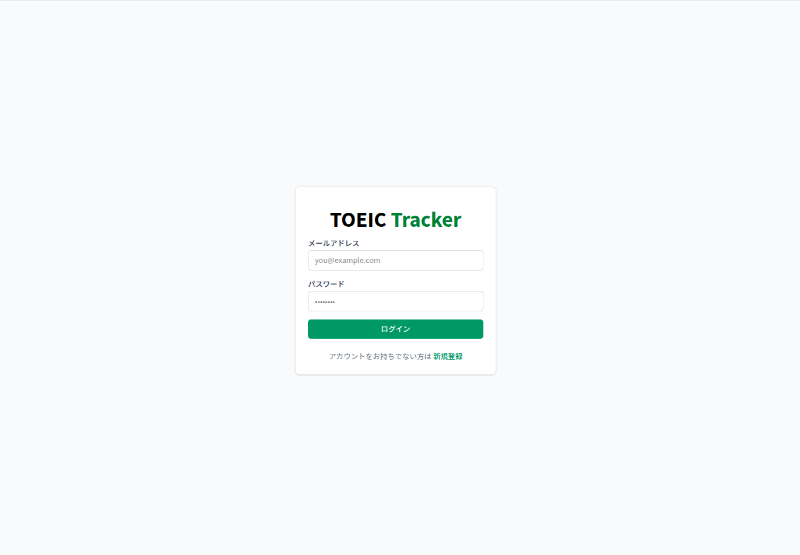
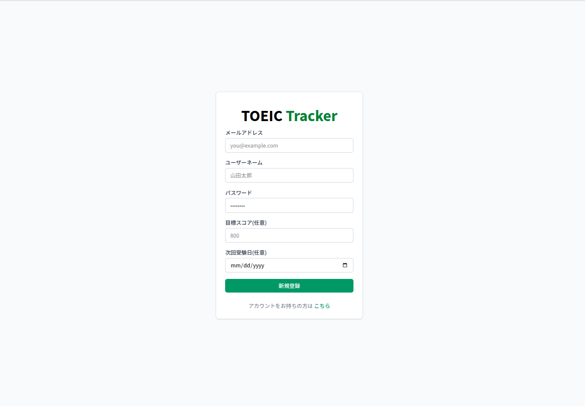
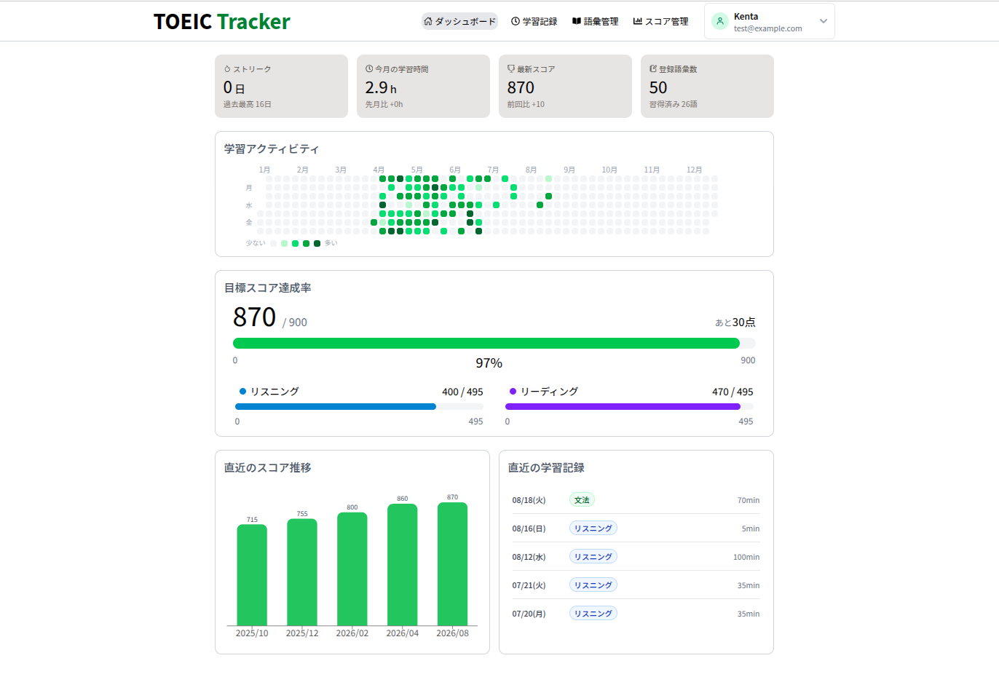
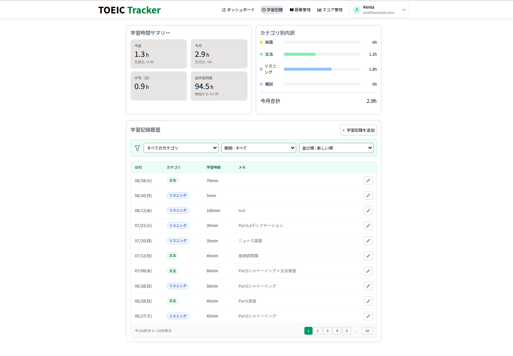
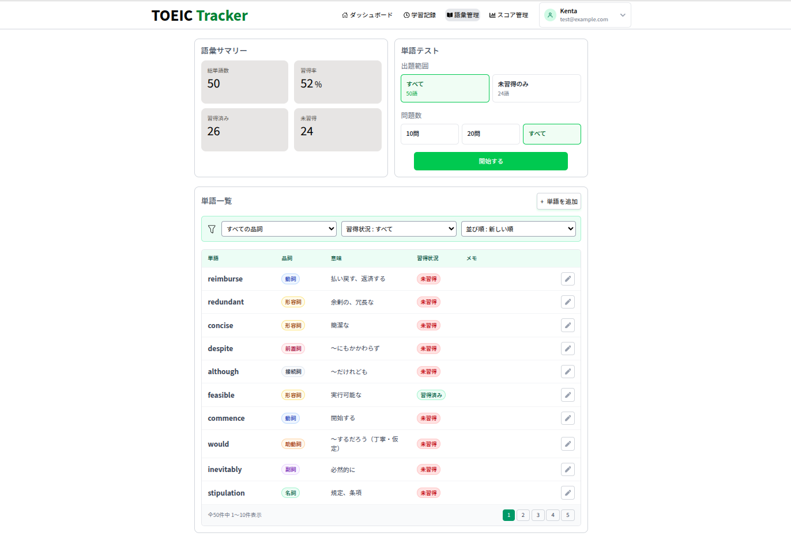
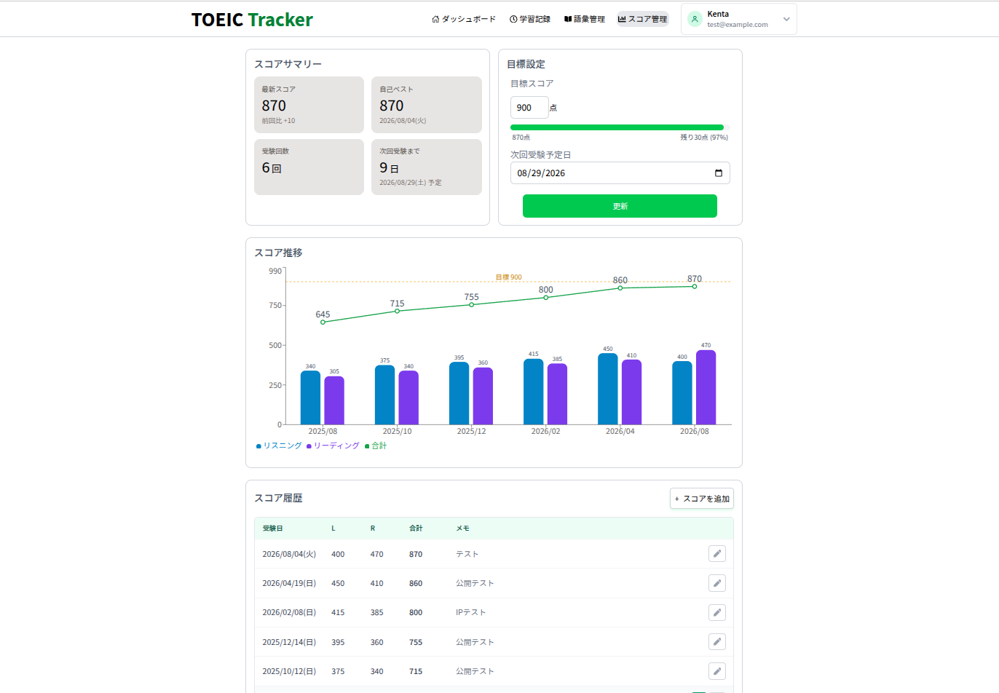
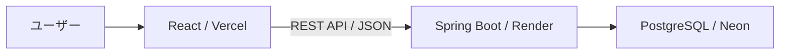

# TOEIC Tracker

TOEIC学習の目標・スコア・学習記録・単語を一元管理できるWebアプリケーションです。

## デモ

- [TOEIC Trackerを開く](https://toeic-tracker-eta.vercel.app)
- メールアドレス：`test@example.com`
- パスワード：`password`

> [!NOTE]
> バックエンドをRenderでホスティングしているため、コールドスタートにより初回のログインに30秒〜1分程度かかる場合があります。

## 開発背景

TOEIC学習に取り組む中で、学習時間はスマートフォンアプリ、単語はノートというように、学習情報を別々の場所で管理することに煩わしさを感じていました。

そこで、目標・スコア・学習記録・単語を一元管理できる「TOEIC Tracker」を開発しました。今後、自身がTOEICを受験する際にも実際に活用し、利用を通じて得た気づきを機能改善に反映していく予定です。

## スクリーンショット・主な機能

<table>
  <tr>
    <td width="50%" valign="top">
      <h3 align="center">ログイン</h3>
      

        
      

      <ul>
        <li>メールアドレスとパスワードによるログイン</li>
        <li>JWTを使用した認証</li>
      </ul>
    </td>
    <td width="50%" valign="top">
      <h3 align="center">ユーザー登録</h3>
      

        
      

      <ul>
        <li>新規ユーザーの登録</li>
        <li>目標スコアと次回受験日の設定</li>
      </ul>
    </td>
  </tr>
  <tr>
    <td width="50%" valign="top">
      <h3 align="center">ダッシュボード</h3>
      

        
      

      <ul>
        <li>目標スコアと次回受験日の確認・変更</li>
        <li>ベストスコアに応じた目標達成状況の表示</li>
        <li>スコアや学習状況の確認</li>
        <li>ユーザー名・パスワードの変更</li>
      </ul>
    </td>
    <td width="50%" valign="top">
      <h3 align="center">学習記録管理</h3>
      

        
      

      <ul>
        <li>学習記録の登録・編集・削除</li>
        <li>カテゴリー別の学習記録</li>
        <li>学習履歴の確認</li>
      </ul>
    </td>
  </tr>
  <tr>
    <td width="50%" valign="top">
      <h3 align="center">単語管理</h3>
      

        
      

      <ul>
        <li>英単語の登録・編集・削除</li>
        <li>登録した単語からの単語テスト</li>
        <li>単語の習得状況の管理</li>
      </ul>
    </td>
    <td width="50%" valign="top">
      <h3 align="center">スコア管理</h3>
      

        
      

      <ul>
        <li>TOEICスコアの登録・編集・削除</li>
        <li>スコア推移の可視化</li>
        <li>受験履歴の確認</li>
      </ul>
    </td>
  </tr>
</table>

## 使用技術

| 分類 | 技術 |
| --- | --- |
| フロントエンド | React / TypeScript / Vite |
| UI | Tailwind CSS |
| フォーム | React Hook Form |
| データ取得・キャッシュ | TanStack Query |
| バックエンド | Java / Spring Boot |
| 認証・認可 | Spring Security / JWT |
| データアクセス | Spring Data JPA |
| データベース | PostgreSQL / Neon |
| マイグレーション | Flyway |
| フロントエンドテスト | Vitest / React Testing Library |
| バックエンドテスト | JUnit / Mockito / MockMvc |
| CI | GitHub Actions |
| ホスティング | Vercel / Render |

## システム構成

## 工夫した点

### フロントエンドの責務分離

APIへのアクセス処理をカスタムフックにまとめ、画面コンポーネントがUIの表示に集中できる構成にしました。

### APIレスポンスの統一

Spring Bootの `ProblemDetail` を使用してエラーレスポンスを統一しました。
入力エラーや認証エラーなどの内容を、フロントエンドで適切に表示できるようにしています。

### JWTによる認証

Spring SecurityとJWTを使用し、ログインユーザーごとにスコア・学習記録・単語を管理しています。
他のユーザーが所有するデータを操作できないよう、バックエンド側でも所有者を検証しています。

### テストの実装

サービス層のユニットテストに加え、MockMvcを使用したControllerのテスト、
VitestとReact Testing Libraryを使用したフロントエンドのテストを実装しました。

### CIによる自動チェック

GitHub Actionsを使用し、Pull Request作成時にテストとビルドを自動実行しています。

## 今後の改善

- 実際のTOEIC学習で使用し、利用を通じて見つかった課題を改善する
- テストケースを追加し、品質を向上させる