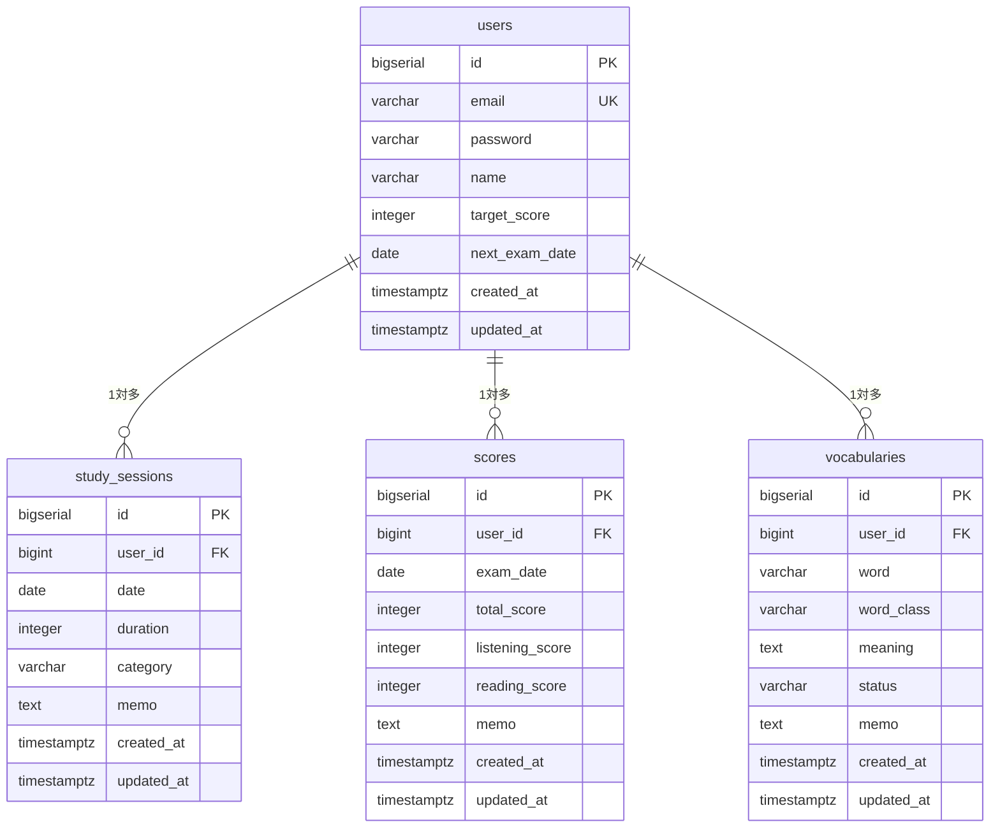

# TOEICトラッカー DB設計書

**バージョン**: 1.1.0  
**作成日**: 2026-07-17  
**作成者**: k-tomida  
**DB**: PostgreSQL 15（Neon / dev branch分離）  
**マイグレーション管理**: Flyway

---

## 1. ER図



---

## 2. テーブル定義

### 2.1 users

| カラム名 | 型 | NULL | デフォルト | 説明 |
|----------|-----|------|-----------|------|
| id | BIGSERIAL | NOT NULL | auto | PK |
| email | VARCHAR(255) | NOT NULL | - | メールアドレス（ユニーク） |
| password | VARCHAR(255) | NOT NULL | - | BCryptハッシュ |
| name | VARCHAR(100) | NOT NULL | - | 表示名 |
| target_score | INTEGER | NULL | - | 目標スコア（10〜990） |
| next_exam_date | DATE | NULL | - | 次回受験予定日 |
| created_at | TIMESTAMPTZ | NOT NULL | NOW() | 作成日時 |
| updated_at | TIMESTAMPTZ | NOT NULL | NOW() | 更新日時 |

**制約**
```sql
CREATE TABLE users (
    id              BIGSERIAL    PRIMARY KEY,
    email           VARCHAR(255) NOT NULL UNIQUE,
    password        VARCHAR(255) NOT NULL,
    name            VARCHAR(100) NOT NULL,
    target_score    INTEGER      CHECK (target_score BETWEEN 10 AND 990),
    next_exam_date  DATE,
    created_at      TIMESTAMPTZ  NOT NULL DEFAULT NOW(),
    updated_at      TIMESTAMPTZ  NOT NULL DEFAULT NOW()
);
```

---

### 2.2 study_sessions

| カラム名 | 型 | NULL | デフォルト | 説明 |
|----------|-----|------|-----------|------|
| id | BIGSERIAL | NOT NULL | auto | PK |
| user_id | BIGINT | NOT NULL | - | FK → users.id |
| date | DATE | NOT NULL | - | 学習日 |
| duration | INTEGER | NOT NULL | - | 学習時間（分）1〜1440 |
| category | VARCHAR(20) | NOT NULL | - | カテゴリ（enum） |
| memo | TEXT | NULL | - | メモ（最大500文字） |
| created_at | TIMESTAMPTZ | NOT NULL | NOW() | 作成日時 |
| updated_at | TIMESTAMPTZ | NOT NULL | NOW() | 更新日時 |

**categoryの値**  
`LISTENING` / `VOCABULARY` / `GRAMMAR` / `MOCK_EXAM`  

**制約**
```sql
CREATE TABLE study_sessions (
    id         BIGSERIAL    PRIMARY KEY,
    user_id    BIGINT       NOT NULL REFERENCES users(id) ON DELETE CASCADE,
    date       DATE         NOT NULL,
    duration   INTEGER      NOT NULL CHECK (duration BETWEEN 1 AND 1440),
    category   VARCHAR(20)  NOT NULL,
    memo       TEXT         CHECK (char_length(memo) <= 500),
    created_at TIMESTAMPTZ  NOT NULL DEFAULT NOW(),
    updated_at TIMESTAMPTZ  NOT NULL DEFAULT NOW()
);

CREATE INDEX idx_study_sessions_user_date ON study_sessions(user_id, date);
```

---

### 2.3 scores

| カラム名 | 型 | NULL | デフォルト | 説明 |
|----------|-----|------|-----------|------|
| id | BIGSERIAL | NOT NULL | auto | PK |
| user_id | BIGINT | NOT NULL | - | FK → users.id |
| exam_date | DATE | NOT NULL | - | 受験日 |
| total_score | INTEGER | NOT NULL | - | 合計スコア（10〜990） |
| listening_score | INTEGER | NOT NULL | - | リスニング（5〜495） |
| reading_score | INTEGER | NOT NULL | - | リーディング（5〜495） |
| memo | TEXT | NULL | - | メモ（最大200文字） |
| created_at | TIMESTAMPTZ | NOT NULL | NOW() | 作成日時 |
| updated_at | TIMESTAMPTZ | NOT NULL | NOW() | 更新日時 |

**制約**
```sql
CREATE TABLE scores (
    id              BIGSERIAL   PRIMARY KEY,
    user_id         BIGINT      NOT NULL REFERENCES users(id) ON DELETE CASCADE,
    exam_date       DATE        NOT NULL,
    total_score     INTEGER     NOT NULL CHECK (total_score BETWEEN 10 AND 990),
    listening_score INTEGER     NOT NULL CHECK (listening_score BETWEEN 5 AND 495),
    reading_score   INTEGER     NOT NULL CHECK (reading_score BETWEEN 5 AND 495),
    memo            TEXT        CHECK (char_length(memo) <= 200),
    created_at      TIMESTAMPTZ NOT NULL DEFAULT NOW(),
    updated_at      TIMESTAMPTZ NOT NULL DEFAULT NOW(),
    CONSTRAINT chk_score_sum CHECK (listening_score + reading_score = total_score)
);

CREATE INDEX idx_scores_user_date ON scores(user_id, exam_date);
```

---

### 2.4 vocabularies

| カラム名 | 型 | NULL | デフォルト | 説明 |
|----------|-----|------|-----------|------|
| id | BIGSERIAL | NOT NULL | auto | PK |
| user_id | BIGINT | NOT NULL | - | FK → users.id |
| word | VARCHAR(200) | NOT NULL | - | 単語・フレーズ |
| word_class | VARCHAR(20) | NOT NULL | - | 品詞（enum） |
| meaning | TEXT | NOT NULL | - | 意味 |
| status | VARCHAR(20) | NOT NULL | 'unacquired' | 学習ステータス（enum） |
| memo | TEXT | NULL | - | メモ・例文など（最大500文字） |
| created_at | TIMESTAMPTZ | NOT NULL | NOW() | 作成日時 |
| updated_at | TIMESTAMPTZ | NOT NULL | NOW() | 更新日時 |

**word_classの値**  
`noun` / `verb` / `adjective` / `adverb` / `preposition` / `conjunction` / `auxiliaryVerb`

**statusの値**  
`acquired`（習得済） / `unacquired`（未習得）

**制約**
```sql
CREATE TABLE vocabularies (
    id          BIGSERIAL    PRIMARY KEY,
    user_id     BIGINT       NOT NULL REFERENCES users(id) ON DELETE CASCADE,
    word        VARCHAR(200) NOT NULL,
    word_class  VARCHAR(20)  NOT NULL,
    meaning     TEXT         NOT NULL,
    status      VARCHAR(20)  NOT NULL DEFAULT 'unacquired',
    memo        TEXT         CHECK (char_length(memo) <= 500),
    created_at  TIMESTAMPTZ  NOT NULL DEFAULT NOW(),
    updated_at  TIMESTAMPTZ  NOT NULL DEFAULT NOW()
);

CREATE INDEX idx_vocabularies_user ON vocabularies(user_id);
CREATE INDEX idx_vocabularies_user_status ON vocabularies(user_id, status);
CREATE INDEX idx_vocabularies_user_word ON vocabularies(user_id, word);
```

---

## 3. 命名規則

| 対象 | 規則 | 例 |
|------|------|----|
| テーブル名 | snake_case・複数形 | `study_sessions` |
| カラム名 | snake_case | `exam_date` |
| PK | `id` 固定 | `id` |
| FK | `{参照テーブル単数形}_id` | `user_id` |
| Entityクラス | PascalCase | `StudySession` |
| Entityフィールド | camelCase | `examDate` |
