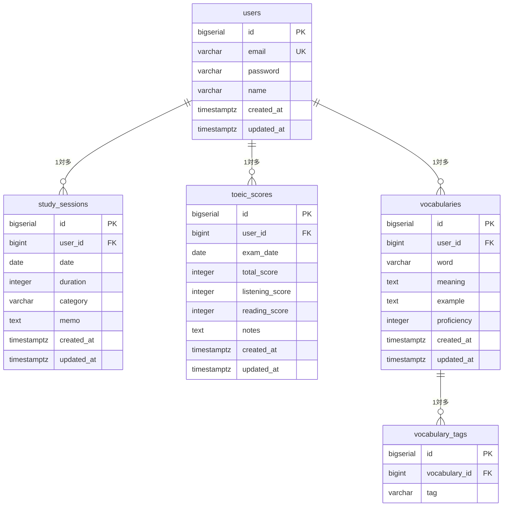

# TOEICトラッカー DB設計書

**バージョン**: 1.0.0  
**作成日**: 2026-06-01  
**作成者**: k-tomida  
**DB**: PostgreSQL 15

---

## 1. ER図



---

## 2. テーブル定義

### 2.1 users

| カラム名 | 型 | NULL | デフォルト | 説明 |
|----------|-----|------|-----------|------|
| id | BIGSERIAL | NOT NULL | auto | PK |
| email | VARCHAR(255) | NOT NULL | - | メールアドレス（ユニーク） |
| password | VARCHAR(255) | NOT NULL | - | BCryptハッシュ |
| name | VARCHAR(100) | NOT NULL | - | 表示名 |
| created_at | TIMESTAMPTZ | NOT NULL | NOW() | 作成日時 |
| updated_at | TIMESTAMPTZ | NOT NULL | NOW() | 更新日時 |

**制約**
```sql
CREATE TABLE users (
    id         BIGSERIAL PRIMARY KEY,
    email      VARCHAR(255) NOT NULL UNIQUE,
    password   VARCHAR(255) NOT NULL,
    name       VARCHAR(100) NOT NULL,
    created_at TIMESTAMPTZ  NOT NULL DEFAULT NOW(),
    updated_at TIMESTAMPTZ  NOT NULL DEFAULT NOW()
);
```

---

### 2.2 study_sessions

| カラム名 | 型 | NULL | デフォルト | 説明 |
|----------|-----|------|-----------|------|
| id | BIGSERIAL | NOT NULL | auto | PK |
| user_id | BIGINT | NOT NULL | - | FK → users.id |
| date | DATE | NOT NULL | - | 学習日 |
| duration | INTEGER | NOT NULL | - | 学習時間（分）1〜480 |
| category | VARCHAR(20) | NOT NULL | - | カテゴリ（enum） |
| memo | TEXT | NULL | - | メモ（最大500文字） |
| created_at | TIMESTAMPTZ | NOT NULL | NOW() | 作成日時 |
| updated_at | TIMESTAMPTZ | NOT NULL | NOW() | 更新日時 |

**categoryの値**  
`LISTENING` / `READING` / `VOCABULARY` / `GRAMMAR` / `MOCK_EXAM` / `OTHER`

**制約**
```sql
CREATE TABLE study_sessions (
    id         BIGSERIAL    PRIMARY KEY,
    user_id    BIGINT       NOT NULL REFERENCES users(id) ON DELETE CASCADE,
    date       DATE         NOT NULL,
    duration   INTEGER      NOT NULL CHECK (duration BETWEEN 1 AND 480),
    category   VARCHAR(20)  NOT NULL,
    memo       TEXT         CHECK (char_length(memo) <= 500),
    created_at TIMESTAMPTZ  NOT NULL DEFAULT NOW(),
    updated_at TIMESTAMPTZ  NOT NULL DEFAULT NOW()
);

CREATE INDEX idx_study_sessions_user_date ON study_sessions(user_id, date);
```

---

### 2.3 toeic_scores

| カラム名 | 型 | NULL | デフォルト | 説明 |
|----------|-----|------|-----------|------|
| id | BIGSERIAL | NOT NULL | auto | PK |
| user_id | BIGINT | NOT NULL | - | FK → users.id |
| exam_date | DATE | NOT NULL | - | 受験日 |
| total_score | INTEGER | NOT NULL | - | 合計スコア（10〜990） |
| listening_score | INTEGER | NOT NULL | - | リスニング（5〜495） |
| reading_score | INTEGER | NOT NULL | - | リーディング（5〜495） |
| notes | TEXT | NULL | - | 備考（最大200文字） |
| created_at | TIMESTAMPTZ | NOT NULL | NOW() | 作成日時 |
| updated_at | TIMESTAMPTZ | NOT NULL | NOW() | 更新日時 |

**制約**
```sql
CREATE TABLE toeic_scores (
    id              BIGSERIAL   PRIMARY KEY,
    user_id         BIGINT      NOT NULL REFERENCES users(id) ON DELETE CASCADE,
    exam_date       DATE        NOT NULL,
    total_score     INTEGER     NOT NULL CHECK (total_score BETWEEN 10 AND 990),
    listening_score INTEGER     NOT NULL CHECK (listening_score BETWEEN 5 AND 495),
    reading_score   INTEGER     NOT NULL CHECK (reading_score BETWEEN 5 AND 495),
    notes           TEXT        CHECK (char_length(notes) <= 200),
    created_at      TIMESTAMPTZ NOT NULL DEFAULT NOW(),
    updated_at      TIMESTAMPTZ NOT NULL DEFAULT NOW(),
    CONSTRAINT chk_score_sum CHECK (listening_score + reading_score = total_score)
);

CREATE INDEX idx_toeic_scores_user_date ON toeic_scores(user_id, exam_date);
```

---

### 2.4 vocabularies

| カラム名 | 型 | NULL | デフォルト | 説明 |
|----------|-----|------|-----------|------|
| id | BIGSERIAL | NOT NULL | auto | PK |
| user_id | BIGINT | NOT NULL | - | FK → users.id |
| word | VARCHAR(200) | NOT NULL | - | 単語・フレーズ |
| meaning | TEXT | NOT NULL | - | 意味 |
| example | TEXT | NULL | - | 例文 |
| proficiency | INTEGER | NOT NULL | 1 | 習熟度（1〜5） |
| created_at | TIMESTAMPTZ | NOT NULL | NOW() | 作成日時 |
| updated_at | TIMESTAMPTZ | NOT NULL | NOW() | 更新日時 |

**制約**
```sql
CREATE TABLE vocabularies (
    id          BIGSERIAL    PRIMARY KEY,
    user_id     BIGINT       NOT NULL REFERENCES users(id) ON DELETE CASCADE,
    word        VARCHAR(200) NOT NULL,
    meaning     TEXT         NOT NULL,
    example     TEXT,
    proficiency INTEGER      NOT NULL DEFAULT 1 CHECK (proficiency BETWEEN 1 AND 5),
    created_at  TIMESTAMPTZ  NOT NULL DEFAULT NOW(),
    updated_at  TIMESTAMPTZ  NOT NULL DEFAULT NOW()
);

CREATE INDEX idx_vocabularies_user ON vocabularies(user_id);
```

---

### 2.5 vocabulary_tags

| カラム名 | 型 | NULL | デフォルト | 説明 |
|----------|-----|------|-----------|------|
| id | BIGSERIAL | NOT NULL | auto | PK |
| vocabulary_id | BIGINT | NOT NULL | - | FK → vocabularies.id |
| tag | VARCHAR(50) | NOT NULL | - | タグ名 |

**制約**
```sql
CREATE TABLE vocabulary_tags (
    id            BIGSERIAL   PRIMARY KEY,
    vocabulary_id BIGINT      NOT NULL REFERENCES vocabularies(id) ON DELETE CASCADE,
    tag           VARCHAR(50) NOT NULL,
    UNIQUE (vocabulary_id, tag)
);
```

---

## 3. Spring Data JPA Entity 対応表

| テーブル | Entityクラス | Repositoryクラス |
|---------|-------------|-----------------|
| users | `User` | `UserRepository` |
| study_sessions | `StudySession` | `StudySessionRepository` |
| toeic_scores | `ToeicScore` | `ToeicScoreRepository` |
| vocabularies | `Vocabulary` | `VocabularyRepository` |
| vocabulary_tags | `VocabularyTag` | `VocabularyTagRepository` |

### Entityリレーション方針

```java
// User → StudySession : 1対多
@OneToMany(mappedBy = "user", cascade = CascadeType.ALL)
private List<StudySession> studySessions;

// User → ToeicScore : 1対多
@OneToMany(mappedBy = "user", cascade = CascadeType.ALL)
private List<ToeicScore> toeicScores;

// User → Vocabulary : 1対多
@OneToMany(mappedBy = "user", cascade = CascadeType.ALL)
private List<Vocabulary> vocabularies;

// Vocabulary → VocabularyTag : 1対多
@OneToMany(mappedBy = "vocabulary", cascade = CascadeType.ALL)
private List<VocabularyTag> tags;
```

> **Note**: Phase 1〜2ではUserリレーションを一時的に省略し、単一ユーザー前提で開発を進めて構わない。Phase 3のJWT認証導入時にuser_idを有効化する。

---

## 4. インデックス設計

| インデックス名 | テーブル | カラム | 目的 |
|----------------|---------|--------|------|
| idx_study_sessions_user_date | study_sessions | (user_id, date) | ヒートマップ・集計クエリ高速化 |
| idx_toeic_scores_user_date | toeic_scores | (user_id, exam_date) | スコア推移グラフ高速化 |
| idx_vocabularies_user | vocabularies | (user_id) | 語彙一覧取得高速化 |

---

## 5. 命名規則

| 対象 | 規則 | 例 |
|------|------|----|
| テーブル名 | snake_case・複数形 | `study_sessions` |
| カラム名 | snake_case | `exam_date` |
| PK | `id` 固定 | `id` |
| FK | `{参照テーブル単数形}_id` | `user_id` |
| Entityクラス | PascalCase | `StudySession` |
| Entityフィールド | camelCase | `examDate` |
